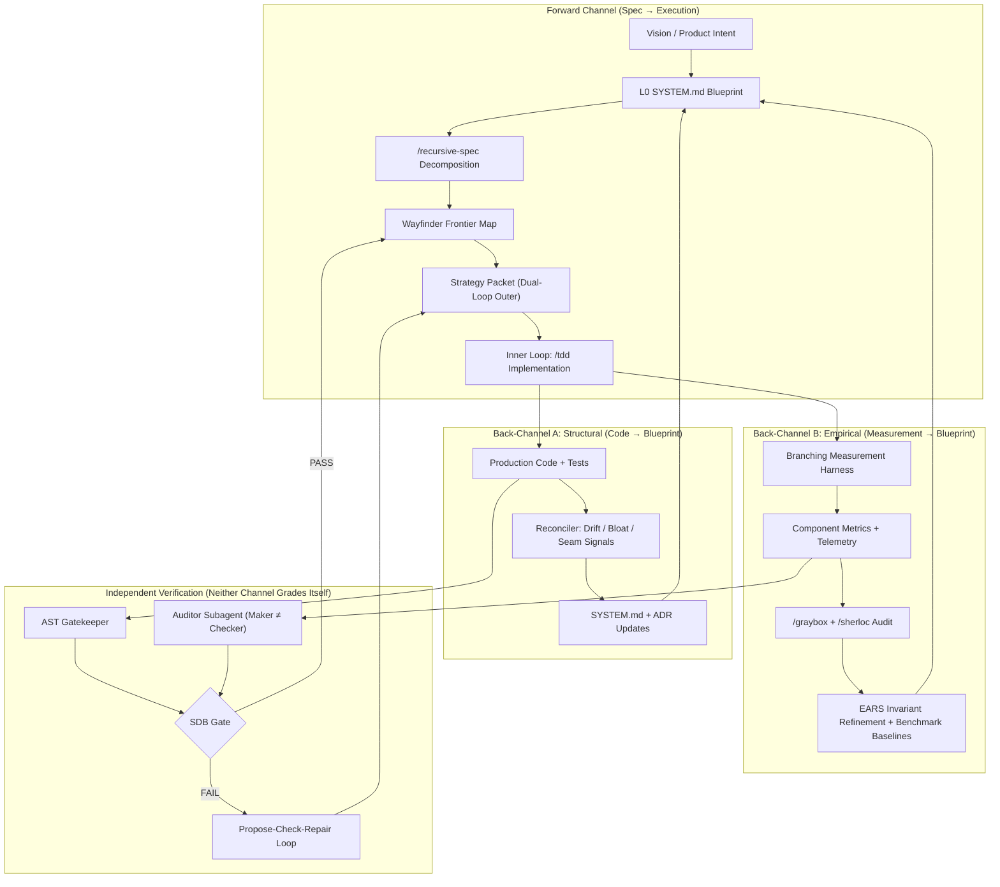
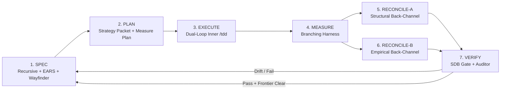

# Dual Back-Channel + Branching Measurement Loop

> **Evolution of RSS:** from "spec → code → reconcile" to a **7-stage closed loop** where architecture blueprints and implementation co-evolve through two independent back-channels — one structural, one empirical — instead of stopping at test-green.

---

## The Problem with Test-Green-Only Loops

Current agentic SDLC patterns (including RSS Phase 0) treat **verification as a binary gate**: tests pass → ship. This creates three failure modes visible in recent loop-engineering literature:

| Failure Mode | Symptom | Root Cause |
|---|---|---|
| **Verification debt** | Agent declares done; behavior is wrong on untested inputs | No measurement beyond the test seam |
| **Authority drift** | Agent alters contracts to make tests pass | Implementor grades its own homework |
| **Comprehension rot** | Blueprint diverges from reality; nobody knows why a component works | Spec updated only on drift, not on measured behavior |

The fix is not "more tests." It is **maximizing the Cumulative Quality Manifold $Q(S)$** — a weighted geometric mean over 7 orthogonal dimensions ($q_{\text{arch}}, q_{\text{impl}}, q_{\text{epistemic}}, q_{\text{perf}}, q_{\text{complex}}, q_{\text{doc}}, q_{\text{ratchet}}$):

$$Q(S) = \exp\left(\sum_{i=1}^{n} w_i \cdot \ln(q_i(S))\right)$$

The geometric mean enforces **compounding**: if docs or architecture desync ($q_{\text{doc}} \to 0.05$), the global score collapses regardless of unit test pass rate. A change is committed **only if $\Delta Q > \varepsilon$ (Pareto improvement)** across the system state.

---

## Architecture Overview



---

## The Two Back-Channels

### Back-Channel A: Structural Reconciliation (already in RSS)

**Direction:** Implementation artifacts → Architecture blueprint  
**Skills:** `/reconcile-spec`, AST Gatekeeper, `code-review-graph`  
**Signals:**

| Signal | Trigger | Blueprint Action |
|---|---|---|
| **Code Drift** | New `/src` file without parent spec | Draft leaf `SYSTEM.md` |
| **Line Bloat** | Spec > 150 lines or > 3 responsibilities | File-to-folder recursive split |
| **Test Seam** | New mock/adapter in TDD | Update parent Interface Contracts |

This channel answers: *"Does the blueprint still describe what exists?"*

### Back-Channel B: Empirical Reconciliation (NEW)

**Direction:** Measured behavior → Architecture blueprint  
**Skills:** `/graybox`, `/sherloc`, autoresearch branching, ODD (Observability-Driven Development)  
**Signals:**

| Signal | Trigger | Blueprint Action |
|---|---|---|
| **Invariant Violation** | Measured behavior contradicts EARS invariant | Refine or split invariant; append ADR |
| **Performance Regression** | Component metric exceeds baseline + tolerance | Add `[State-driven]` performance EARS clause |
| **Telemetry Contradiction** | Self-reported metrics disagree (graybox red test) | Flag instrument as broken; block merge |
| **Unknown Boundary** | Component behavior unclear under load/edge cases | Spawn Wayfinder `research` or `prototype` ticket |

This channel answers: *"Does the blueprint still describe how it actually behaves?"*

**Critical rule:** Back-Channel B never trusts the implementor's self-assessment. Measurement runs on an **isolated branch/worktree**; the **Auditor subagent** (Outer Loop) interprets results and updates the blueprint.

---

## Branching Measurement (Replacing Test-Until-Green)

Inspired by [autoresearch](https://github.com/karpathy/autoresearch), [amp-autoresearch](https://github.com/lox/amp-autoresearch), ODD, and BranchBench microbenchmark primitives.

### Per-Leaf Measurement Contract

Every Atomic Leaf `SYSTEM.md` gains a **Section 7: Measurement Seams**:

```markdown
## 7. Measurement Seams (Leaf Nodes Only)

### Primary Metric
- **Name:** `query_pipeline_p99_ms`
- **Target:** ≤ 50ms at p99 (baseline recorded on first green)
- **Harness:** `components/QUERY_PIPELINE/measure.sh`

### Correctness Backpressure
- **Harness:** `components/QUERY_PIPELINE/checks.sh`
- **Rule:** checks MUST pass before any metric improvement is kept

### Telemetry Surface
- Self-diagnosis commands the Auditor may invoke without reading source
- Expected structured output schema (JSON fields, exit codes)

### Branching Policy
- Hypotheses run on isolated git worktrees
- Keep only if: checks pass AND primary metric improves AND no telemetry contradiction
```

### The Branching Measurement Loop

```
┌─────────────────────────────────────────────────────────────┐
│  OUTER LOOP (Architect / Auditor — strategy + measurement)  │
├─────────────────────────────────────────────────────────────┤
│  1. Read leaf SYSTEM.md §6 (test seam) + §7 (measure seam)  │
│  2. Record baseline: measure.sh → log baseline to .measure/ │
│  3. Generate Strategy Packet for Inner Loop                 │
│  4. Hand off to Inner Loop in isolated worktree             │
│  5. On "done" signal:                                       │
│     a. Run checks.sh (correctness backpressure)             │
│     b. Run measure.sh (primary + secondary metrics)         │
│     c. Run /graybox Phase 0 (validate instrument)           │
│     d. Compare against baseline; keep or revert branch      │
│  6. Update SYSTEM.md baselines + ADRs via Back-Channel B    │
│  7. Emit next Wayfinder ticket or close frontier leaf       │
└─────────────────────────────────────────────────────────────┘
                              │
                              ▼
┌─────────────────────────────────────────────────────────────┐
│  INNER LOOP (Implementor — tactical, NO GIT, NO SPEC EDITS) │
├─────────────────────────────────────────────────────────────┤
│  1. Read Strategy Packet only (minimal context)            │
│  2. /tdd against §4 EARS invariants + §6 test seam          │
│  3. Run local tests (self-check, not authoritative)         │
│  4. Signal "done" — does NOT declare success                │
└─────────────────────────────────────────────────────────────┘
```

**Why branching?** A single working tree conflates hypotheses. BranchBench research shows agent workflows need explicit `create_branch → mutate → measure → keep|delete` primitives. Without them, "optimization" becomes unmeasurable narrative.

---

## The 7-Stage Master Loop

Evolution of the 4-stage SDLC in `MISSING_ARCHITECTURAL_PILLARS.md`:



| Stage | Agent Role | Primary Skills | Verification Level |
|---|---|---|---|
| **1. SPEC** | Architect | `/recursive-spec`, `/wayfinder`, `/domain-modeling` | EARS syntax + doc-readiness gate |
| **2. PLAN** | Architect (Outer) | `/to-spec`, dual-loop packet authoring | Strategy packet completeness |
| **3. EXECUTE** | Implementor (Inner) | `/tdd`, `/implement` | Self-check only (non-authoritative) |
| **4. MEASURE** | Auditor (Outer) | measure.sh, `/graybox`, `/sherloc` | L1 deterministic metrics + L3 delayed truth |
| **5. RECONCILE-A** | Reconciler | `/reconcile-spec`, AST Gatekeeper | L2 schema/drift rules |
| **6. RECONCILE-B** | Auditor | Baseline diff, invariant cross-check | L1 + metamorphic relations |
| **7. VERIFY** | Auditor (independent) | `code-review-graph`, dual-loop verify | Maker ≠ Checker; SDB gate |

---

## Skill Integration Map

How skills from `resources/skills` slot into the loop:

| Skill | Loop Stage | Role |
|---|---|---|
| `/wayfinder` | 1, 7 | Decision frontier; fog-of-war; one ticket per session |
| `/recursive-spec` | 1 | Fractal SYSTEM.md decomposition to atomic leaves |
| `/domain-modeling` | 1 | Ubiquitous language before spec writing |
| `/grilling` | 1 | Sharpen decisions before ticketing |
| `/to-spec` | 2 | Synthesize conversation → bounded spec artifact |
| `/tdd` | 3 | Inner loop implementation against EARS |
| `/implement` | 3 | Broader implementation when TDD seam insufficient |
| `/prototype` | 1, 4 | Raise fidelity for unclear behavior boundaries |
| `/research` | 1, 4 | AFK fact-finding for blocked decisions |
| `/graybox` | 4, 6 | Component measurement without reading source |
| `/sherloc` | 4, 6, 7 | Formal audit of complex claims; proof ledger |
| `/code-review` | 7 | Standards + defect review |
| `/reconcile-spec` | 5 | Multi-signal structural back-channel |
| `/diagnosing-bugs` | 4, 7 | When measurement reveals regression |
| `/codebase-design` | 1, 5 | Deep module interface design |
| dual-loop (pattern) | 2–7 | Outer/inner separation; correction packets |

---

## New L1 Component: MEASUREMENT_HARNESS

Proposed 5th core component (alongside SpecEngine, Reconciler, WayfinderConnector, ASTGatekeeper):

```
docs/architecture/MEASUREMENT_HARNESS/
└── SYSTEM.md
```

### Responsibility
Manages per-component `measure.sh`, `checks.sh`, baseline logs (`.measure/<component>/log.jsonl`), and branching lifecycle for hypothesis isolation.

### EARS Invariants
- [Ubiquitous] The Measurement Harness SHALL record a baseline metric before any optimization loop begins.
- [Event-driven] WHEN checks.sh fails THE SYSTEM SHALL block keep/revert-to-baseline regardless of primary metric.
- [Conditional] IF telemetry self-contradiction is detected THEN THE SYSTEM SHALL flag the instrument as broken and halt Back-Channel B updates.
- [State-driven] WHILE a hypothesis branch is active THE SYSTEM SHALL isolate mutations from the main blueprint branch.

### Interface with Wayfinder
When measurement reveals an unknown boundary (component behavior unclear), the harness emits a Wayfinder ticket:
- Type: `research` (AFK) or `prototype` (HITL)
- Question: "What is the p99 behavior of X under Y load condition?"
- Blocks: parent leaf implementation ticket until resolved

---

## Verification Ladder (Where RSS Sits)

From Loop Engineering (Sandeco Macedo, 2026) — RSS targets **Levels 1–3** for autonomous operation:

| Level | Check Type | RSS Implementation |
|---|---|---|
| **L1 Deterministic** | Exit code, assertion, golden output | `checks.sh`, unit tests, EARS→test mapping |
| **L2 Rule/Schema** | Linter, AST, policy | AST Gatekeeper, EARS syntax prover |
| **L3 Delayed Truth** | Integration, deploy, real workload | `measure.sh` on realistic fixtures, graybox |
| **L4 Model Judge** | Rubric scoring | ❌ Avoid for merge gates; Auditor uses different model if needed |
| **L5 Human Checkpoint** | Manual approval | Wayfinder HITL tickets only |

**Design rule:** Never pretend L4 is L1. The Implementor's "tests pass" is L1 self-check. The Outer Loop's `measure.sh + checks.sh + graybox` is the authoritative L1–L3 stack.

---

## Dual-Loop + Dual-Back-Channel Composition

These are orthogonal axes:

```
                    FORWARD
                       │
    ┌──────────────────┼──────────────────┐
    │                  ▼                  │
    │            Strategy Packet          │
    │                  │                  │
 BACK-A ◄──── Reconciler ◄──── Code ────► Measure ────► Back-B
 (structural)              ▲                  │
                           │                  │
                    Inner Loop (/tdd)          │
                           │                  │
                    Outer Loop verifies ◄──────┘
                           │
                      SDB Gate
```

- **Dual-Loop** = who executes vs who verifies (horizontal agent separation)
- **Dual-Back-Channel** = what flows back to the blueprint (structural vs empirical)
- **Branching Measurement** = how empirical truth is isolated and compared

---

## Concrete Session Flow (One Wayfinder Leaf Ticket)

Using ticket `01-spec-engine` as example:

1. **Claim** `[01-spec-engine]` on Wayfinder map
2. **Load** `docs/architecture/SPEC_ENGINE/SYSTEM.md`
3. **Plan (Outer):** Write strategy packet + scaffold `components/SPEC_ENGINE/measure.sh` (e.g., `specs_generated_per_sec`, `ears_validation_pass_rate`)
4. **Baseline (Outer):** Run measure.sh on current state → `.measure/spec_engine/baseline.json`
5. **Execute (Inner):** Hand packet; Inner implements `src/spec_engine/generator.py` via `/tdd`
6. **Measure (Outer):** Run checks.sh → measure.sh → graybox instrument validation
7. **Reconcile-A:** `/reconcile-spec` scans for new files, seam expansions
8. **Reconcile-B:** Compare metrics to baseline; if invariant "SHALL format all invariants using EARS" now measurable at 100% validation rate, record in SYSTEM.md §7
9. **Verify:** AST Gatekeeper + `/code-review` as independent Auditor
10. **Close ticket;** update Wayfinder Decisions-so-far; graduate fog if any

---

## What Comes Next in the Loop (Priority Order)

### Phase 1 — Measurement Seam Scaffolding
- Add §7 template to `recursive-spec` skill
- Create `MEASUREMENT_HARNESS/SYSTEM.md` L1 node
- Add Wayfinder ticket `05-measurement-harness`

### Phase 2 — Dual-Loop Protocol Skill
- Author `/dual-loop` skill (adapt Project Sanctuary pattern)
- Strategy packet + correction packet templates in `.scratch/handoffs/`

### Phase 3 — Baseline Infrastructure
- `.measure/` directory convention + `log.jsonl` append-only format
- Pre-commit hook: block merge if checks.sh fails (L1)
- CI: run measure.sh on changed components (L3)

### Phase 4 — Empirical Reconciler
- Extend Reconciler with Signal D: **Metric Drift** (baseline regression)
- Auto-spawn Wayfinder `research` tickets on unknown boundaries

### Phase 5 — Kitchen Loop Integration
- Specification surface (SYSTEM.md tree) + Unbeatable Tests (checks.sh) + Drift Control (measure baselines) = unified trust model per Kitchen Loop paper

---

## Research Grounding

| Concept | Source | RSS Application |
|---|---|---|
| Dual-Loop Architecture | Project Sanctuary, Loop Engineering | Outer strategy / Inner execution |
| Stochastic-Deterministic Boundary | arXiv:2512.20660 | SDB gate before blueprint merge |
| Verification Ladder L1–L3 | arXiv:2607.00038 | checks.sh + measure.sh + graybox |
| Branching Primitives | BranchBench (arXiv:2604.17180) | Isolated hypothesis worktrees |
| Autoresearch Loop | karpathy/autoresearch | edit → measure → keep/revert |
| Observability-Driven Dev | Stack Overflow ODD | Measurement seams at design time |
| Kitchen Loop Trust Model | arXiv:2603.25697 | Spec surface + unbeatable tests + drift control |
| Gray-Box Evaluation | graybox skill | Telemetry as claim, not ground truth |
| Wayfinder Fog of War | wayfinder skill | Don't ticket what you can't state precisely |

---

## Summary

**Before:** RSS = fractal specs + reconcile on drift + test-green gate.  
**After:** RSS = fractal specs + **two back-channels** (structure + behavior) + **branching measurement** + **dual-loop agent separation** + **SDB verification ladder**.

The architecture blueprint is no longer a document you write once. It is a **continuously measured, dual-fed living contract** — structurally reconciled from code shape, empirically reconciled from component behavior — with Wayfinder governing what decision comes next and branching measurement ensuring "green" means *understood*, not just *passing*.
