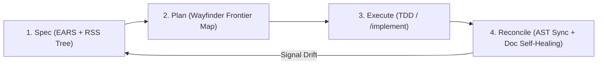

# The Missing Architectural Pillars for Living RSS

By cross-referencing modern **2026 Spec-Driven Development (SDD)** standards, **EARS (Easy Approach to Requirements Syntax)**, and **AWS Kiro / Spec-Kit patterns**, we identified 4 critical gaps in our architecture engine:

---

## Gap 1: EARS Syntax for Living Invariants (Machine-Unambiguous Contracts)

### The Problem
Prose invariants like *"the search bar should be fast"* or *"handle profile updates cleanly"* cause AI agents to guess, leading to implementation drift.

### The Fix: EARS Syntax in `SYSTEM.md`
Every leaf node `SYSTEM.md` must express its invariants using standard EARS keywords:

| Pattern | EARS Format | Example in RSS Node |
|---|---|---|
| **Event-driven** | `WHEN [trigger] THE SYSTEM SHALL [action]` | `WHEN user enters >2 chars THE SYSTEM SHALL trigger debounced search.` |
| **State-driven** | `WHILE [state] THE SYSTEM SHALL [action]` | `WHILE query is fetching THE SYSTEM SHALL render skeleton loaders.` |
| **Conditional** | `IF [condition] THEN THE SYSTEM SHALL [action]` | `IF search API returns 429 THEN THE SYSTEM SHALL fallback to cached results.` |

---

## Gap 2: Architectural Significant Requirements (ASRs) & Decision Hygiene

### The Problem
When an AI agent splits a spec file or changes an interface during TDD, it knows *what* changed, but loses *why* it changed.

### The Fix: Lightweight Inlined ADRs
Every `SYSTEM.md` includes an `## Architectural Decisions (ADRs)` block.
When dynamic auto-expansion occurs, the agent appends a 3-line record:
```markdown
### ADR-003: Split BioForm into RichText + Privacy Toggle
- **Context:** `ProfilePage.md` crossed line limit threshold.
- **Decision:** Split into separate child spec nodes to isolate rich text state from privacy API sync.
- **Impact:** `Wayfinder` emitted 2 child frontier tickets.
```

---

## Gap 3: Executable Contract Gates (Zero-Drift Enforcement)

### The Problem
Natural language specs can be ignored by an over-eager coding agent during implementation.

### The Fix: Structural Contract Validation (CI / Pre-commit Gate)
Use local AST tools (`code-review-graph` or `graphgraph`) in pre-commit / CI to act as a **Gatekeeper**:
1. Check that every exported TS/Rust type matching a `SYSTEM.md` schema has valid unit test coverage (`query_graph pattern="tests_for"`).
2. Block commits if a file in `/src` has no parent node in `/docs/architecture`.

---

## Gap 4: The 4-Stage Agentic SDLC Loop



By adding these 4 pillars, our **Evolutionary RSS Engine** transitions from a good documentation structure into an **enterprise-grade, self-healing SDLC platform**.
