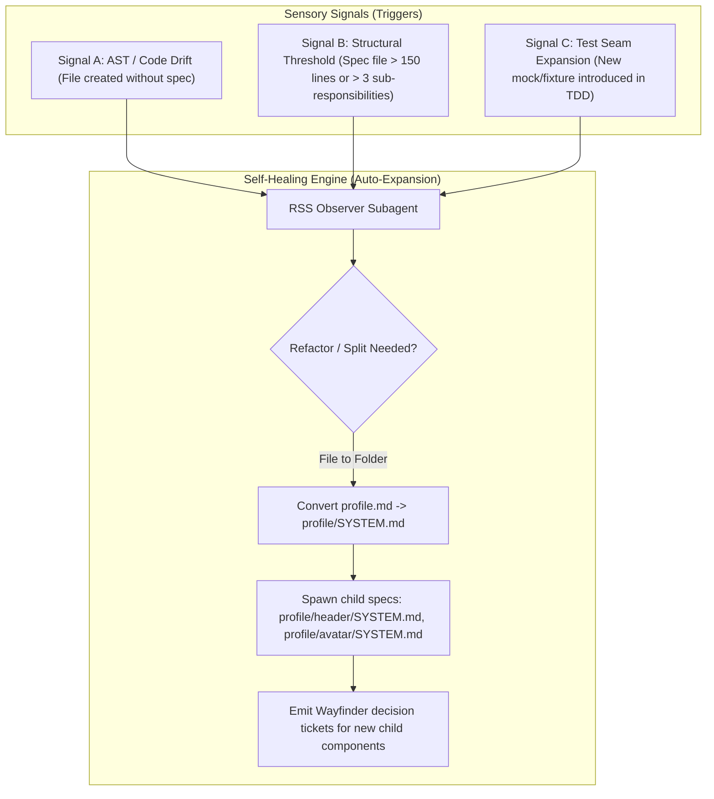

# Self-Healing & Auto-Expanding Spec Engine (Multi-Signal RSS)

## 1. Core Paradigm: Multi-Signal Code-to-Doc Feedback Loops

In traditional development, documentation is static. Developers write code, and the docs fall behind.
In **Multi-Signal RSS**, documentation acts like a **living organism** with sensory signals listening to the codebase and the build process.



---

## 2. The 3 Sensory Signals for Auto-Expansion

### Signal 1: AST Code Drift (Unspec'd File / Symbol Created)
- **What happens:** An agent or human creates `src/components/profile/AvatarUploader.tsx`.
- **Observer Check:** The git hook / `code-review-graph` runs and asks: *"Is there an existing `SYSTEM.md` tracking `AvatarUploader`?"*
- **Action:** If missing, the system generates a draft spec node `docs/architecture/PROFILE/AVATAR_UPLOADER/SYSTEM.md` and links it back to the parent `PROFILE/SYSTEM.md`.

### Signal 2: Structural Bloat Threshold (File-to-Folder Refactoring)
- **What happens:** A spec node `PROFILE/SYSTEM.md` grows to cover headers, bio forms, settings tabs, and avatar uploading.
- **Observer Check:** When a spec file exceeds ~150 lines or defines more than 3 distinct UI/logic responsibilities, it triggers a **Recursive Division Event**.
- **Action:**
  1. `PROFILE.md` is converted into a directory `PROFILE/SYSTEM.md`.
  2. Sub-components are broken out recursively:
     - `PROFILE/HEADER/SYSTEM.md`
     - `PROFILE/BIO_FORM/SYSTEM.md`
     - `PROFILE/AVATAR_UPLOADER/SYSTEM.md`

### Signal 3: Test Seam Expansion
- **What happens:** During TDD, an agent has to inject a new mock (e.g. `S3ImageStore`).
- **Observer Check:** The test setup introduced a new external dependency seam not present in the parent spec interface contract.
- **Action:** The agent updates the parent spec's `Inputs & Outputs / Invariants` block to explicitly document the `S3ImageStore` seam.

---

## 3. Concrete Example: The `ProfilePage` Evolution

### Step 1: Initial Simple Spec (Day 1)
```
/docs/architecture/
└── PROFILE_PAGE.md   (Single file spec covering simple profile view)
```

### Step 2: Code Expansion & Signal Trigger (Day 3)
Developer builds out user status, avatar cropper, and privacy toggles. The `PROFILE_PAGE.md` file crosses the complexity threshold.

### Step 3: Automatic Recursive Subdivision (Day 4)
The engine refactor transforms the flat file into a fractal folder structure:

```
/docs/architecture/PROFILE_PAGE/
├── SYSTEM.md                          # Master Profile Page Layout & State Manager
├── HEADER_SECTION/
│   ├── SYSTEM.md                      # Cover Image & Basic Metadata
│   └── AVATAR_CROPPER/
│       └── SYSTEM.md                  # Atomic Canvas Image Cropper (Leaf Node)
├── BIO_FORM/
│   └── SYSTEM.md                      # Rich Text User Bio & Invariant Validation
└── PRIVACY_SETTINGS/
    └── SYSTEM.md                      # Visibility Toggles & API Sync
```

---

## 4. How Wayfinder Reacts to Signal Auto-Expansion

When `PROFILE_PAGE.md` is dynamically split into sub-folders:

1. The RSS Observer agent posts a comment on the master **Wayfinder Map Issue**:
   > ⚡ **System Auto-Expansion Signal Triggered**: `ProfilePage` grew beyond atomic threshold. Decomposed into 3 child sub-systems.
2. Wayfinder creates 3 child tickets (`[Profile] Implement Avatar Cropper`, `[Profile] Bio Form Validation`, etc.) on the active frontier.
3. Development continues seamlessly on the newly isolated, hyper-specific leaf tickets.
