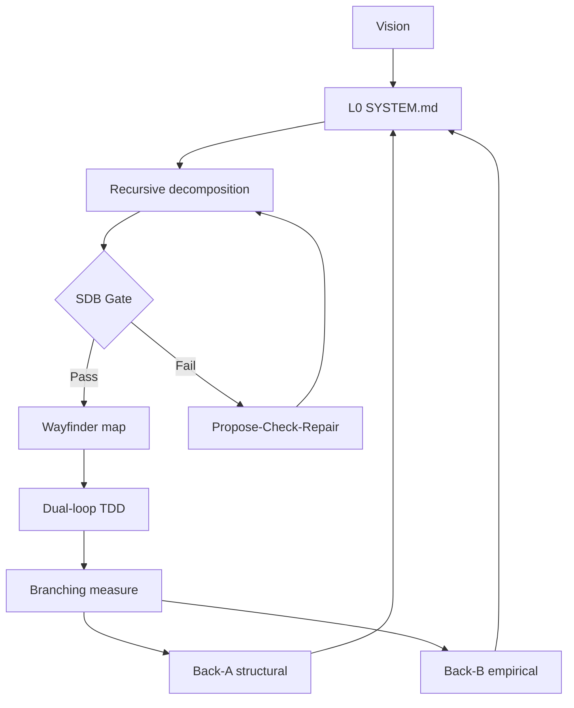

# Recursive System Specification (RSS) Engine & Agentic Framework

> PhD-grounded, multi-signal, self-healing specification process for AI-agent software engineering.

**Living documentation:** [`docs/`](./docs/README.md)  
**Pre-redesign snapshot (reference only):** [`docs/archive/2026-08-02-pre-redesign/`](./docs/archive/2026-08-02-pre-redesign/)  
**Incomplete work (single checklist):** [`docs/open-work.md`](./docs/open-work.md)

The removal gate in `docs/archive/README.md` has been executed: the root essays, the SCREAMING_CASE architecture directories, and `doc-readiness.md` now exist only in the archive and in git history. `docs/` is the single living tree.

---

## Executive summary

RSS turns a one-line goal into a tree of components each specified well enough to build, then keeps that tree honest as the code moves. It works by:

1. **Recursively decomposing** a goal, asking of every node *what will implement this?* **before** *what are its parts?* — resolving each to `BUY` / `ADOPT` / `WRAP` / `BUILD` / `DEFER`
2. Building a **fractal tree** of EARS contracts (`docs/architecture/**/SYSTEM.md`), each terminal node carrying a real tech stack (§8), not a topic name
3. Gating stochastic LLM output at a **stochastic–deterministic boundary (SDB)**
4. Executing via **Wayfinder** frontiers (Type A implement / Type B research)
5. Closing the loop with **dual back-channels** (structural + empirical) and **branching measurement**

The recursion has a floor: **a node resolved to a third-party service or library is terminal** — the vendor owns its internals. That single rule both stops "break it down further" from running to absurdity and makes reinventing the wheel a gate failure rather than a review comment.

```
- Login and user accounts          ->   Identity Verification      BUY    (managed IdP)
                                        Session Management         WRAP   (adapter)
  ^ one line, one afternoon of              Policy Evaluation      ADOPT  (Casbin/OPA)
    hand-rolled password hashing            Role & Permission      BUILD  <- your domain
                                        Recovery & Verification    BUY    (delegated)
                                        Deletion & Export          BUILD  <- unbuyable, legally required
                                        Auth Audit Trail           ADOPT  (OpenTelemetry)
```



Details: [docs/process/dual-backchannel-loop.md](./docs/process/dual-backchannel-loop.md) · Research: [docs/research/foundation.md](./docs/research/foundation.md)

---

## Directory structure (living)

```
recursive-system-design/
├── README.md                 # This file
├── docs/
│   ├── README.md             # Doc index
│   ├── glossary.md           # Ubiquitous language
│   ├── install.md            # Installing skills + harness
│   ├── open-work.md          # Sole incomplete-work checklist
│   ├── research/foundation.md
│   ├── examples/
│   │   └── login-decomposition.md   # One flat line → 7 specified nodes
│   ├── process/
│   │   ├── decomposition-loop.md    # Goal → buildable leaves (forward)
│   │   ├── technology-resolution.md # Third-party-first gate
│   │   ├── dual-backchannel-loop.md # Reality → blueprint (backward)
│   │   └── multi-signal-reconciler.md
│   ├── architecture/
│   │   ├── SYSTEM.md         # L0
│   │   ├── spec-engine/
│   │   ├── technology-resolver/
│   │   ├── reconciler/
│   │   ├── wayfinder-connector/
│   │   ├── ast-gatekeeper/
│   │   └── measurement-harness/
│   └── archive/
│       ├── README.md         # Archive-first policy + removal gate
│       └── 2026-08-02-pre-redesign/   # Full snapshot (do not delete)
├── harness/                  # Back-Channel B measurement gate
│   ├── baseline.py           # metric direction + keep/revert comparison
│   ├── hypothesis_runner.py  # checks → measure → compare → keep|revert
│   ├── evidence_logger.py    # append-only .measure/<comp>/log.jsonl
│   ├── manifold_evaluator.py # Q(S) control surface (design intent, OW-14)
│   └── test_harness.py       # the harness's own correctness backpressure
├── skills/                   # recursive-spec, reconcile-spec, dual-loop, …
└── .scratch/wayfinder-map/   # Execution frontier tickets
```

---

## Skills

| Skill | Role |
|-------|------|
| `/recursive-spec` | Goal → fractal `SYSTEM.md` tree: decompose, resolve, EARS, §6/§7/§8 seams |
| `/resolve-stack` | The third-party-first gate on one node — what actually implements this? |
| `/reconcile-spec` | Back-Channel A (+ metric drift when ready) |
| `/dual-loop` | Outer Architect/Auditor vs Inner Implementor |
| `/wayfinder`, `/sherloc` | Frontier + formal audit |

Compose with `/tdd`, `/research`, `/prototype`, `/graybox`, graphgraph, etc.

`/sherloc` and `/wayfinder` are **maintained elsewhere** and are not installed from this repo — see [docs/install.md](./docs/install.md).

---

## Running the measurement gate

Each component supplies `components/<name>/checks.sh` (correctness backpressure) and
`components/<name>/measure.sh` (primary metric as JSON on stdout); templates are in
[`harness/`](./harness/).

```bash
# Evaluate a hypothesis worktree: checks → measure → baseline compare → keep|revert
python harness/hypothesis_runner.py <component> hypothesis/<ticket-id>

# After the Outer Loop actually merges, promote the reading to the trunk baseline
python harness/hypothesis_runner.py <component> hypothesis/<ticket-id> --record-baseline
```

Exit `0` = keep authorized · `1` = revert · `2` = harness error. A regression beyond
`--tolerance` (default 20%) writes a `signal_d` event to `.measure/<component>/log.jsonl`,
which is the Back-Channel B trigger for a Wayfinder Type B research ticket.

The gate refuses to guess: an unparseable measurement, a self-contradicting instrument,
or a metric whose better-direction cannot be resolved all **revert** rather than pass.
Declare `"direction": "lower"|"higher"` in `measure.sh` output when the metric name is
ambiguous.

Harness tests: `python -m pytest harness/test_harness.py -q`

---

## First consumer project

**[featherwAIght-rs](../featherwAIght-rs)** — greenfield Rust rebuild using this pipeline. Keep this repo as process source of truth.

---

## Start here

**Using RSS on a project of your own** — the common case:

1. [docs/process/decomposition-loop.md](./docs/process/decomposition-loop.md) — the loop
2. [docs/examples/login-decomposition.md](./docs/examples/login-decomposition.md) — see it applied
3. [docs/install.md](./docs/install.md) — install the skills, then run `/recursive-spec` on your goal

**Working on RSS itself:**

1. [docs/glossary.md](./docs/glossary.md)  
2. [docs/architecture/SYSTEM.md](./docs/architecture/SYSTEM.md)  
3. [docs/open-work.md](./docs/open-work.md)  
4. Claim a ticket on [`.scratch/wayfinder-map/MAP.md`](./.scratch/wayfinder-map/MAP.md)
