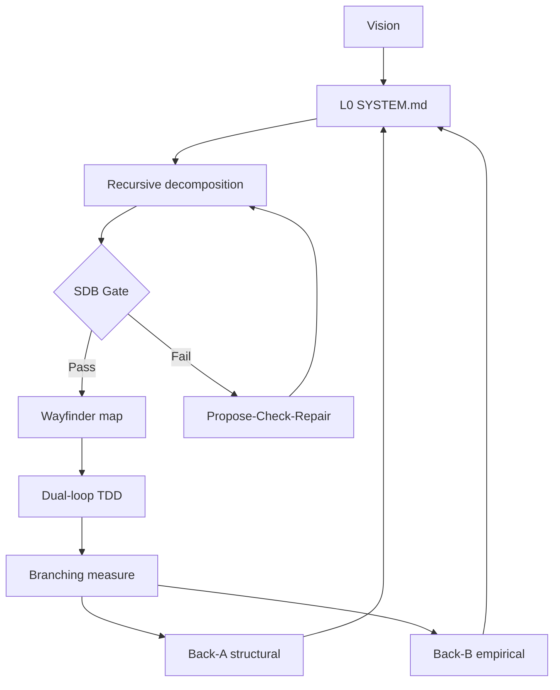

# Recursive System Specification (RSS) Engine & Agentic Framework

> PhD-grounded, multi-signal, self-healing specification process for AI-agent software engineering.

**Living documentation:** [`docs/`](./docs/README.md)  
**Pre-redesign snapshot (reference only):** [`docs/archive/2026-08-02-pre-redesign/`](./docs/archive/2026-08-02-pre-redesign/)  
**Incomplete work (single checklist):** [`docs/open-work.md`](./docs/open-work.md)

Root essays (`CONTEXT.md`, `DUAL_BACKCHANNEL_*`, etc.) are **archived and still present** until the removal gate in `docs/archive/README.md` is executed. Prefer the living tree under `docs/`.

---

## Executive summary

RSS reduces ephemeral context drift and “vibe coding” by:

1. Building a **fractal tree** of EARS contracts (`docs/architecture/**/SYSTEM.md`)
2. Gating stochastic LLM output at a **stochastic–deterministic boundary (SDB)**
3. Executing via **Wayfinder** frontiers (Type A implement / Type B research)
4. Closing the loop with **dual back-channels** (structural + empirical) and **branching measurement**



Details: [docs/process/dual-backchannel-loop.md](./docs/process/dual-backchannel-loop.md) · Research: [docs/research/foundation.md](./docs/research/foundation.md)

---

## Directory structure (living)

```
recursive-system-design/
├── README.md                 # This file
├── docs/
│   ├── README.md             # Doc index
│   ├── glossary.md           # Ubiquitous language
│   ├── open-work.md          # Sole incomplete-work checklist
│   ├── research/foundation.md
│   ├── process/
│   │   ├── dual-backchannel-loop.md
│   │   └── multi-signal-reconciler.md
│   ├── architecture/
│   │   ├── SYSTEM.md         # L0
│   │   ├── spec-engine/
│   │   ├── reconciler/
│   │   ├── wayfinder-connector/
│   │   ├── ast-gatekeeper/
│   │   └── measurement-harness/
│   └── archive/
│       ├── README.md         # Archive-first policy + removal gate
│       └── 2026-08-02-pre-redesign/   # Full snapshot (do not delete)
├── harness/                  # measure/checks prototypes
├── skills/                   # recursive-spec, reconcile-spec, dual-loop, …
└── .scratch/wayfinder-map/   # Execution frontier tickets
```

Legacy root markdown and SCREAMING_CASE architecture dirs may still exist alongside the living tree until **OW-30..OW-32** removal.

---

## Skills

| Skill | Role |
|-------|------|
| `/recursive-spec` | Fractal `SYSTEM.md` tree + EARS + §7 seams |
| `/reconcile-spec` | Back-Channel A (+ metric drift when ready) |
| `/dual-loop` | Outer Architect/Auditor vs Inner Implementor |
| `/wayfinder`, `/sherloc` | Frontier + formal audit |

Compose with `/tdd`, `/research`, `/prototype`, `/graybox`, graphgraph, etc.

---

## First consumer project

**[featherwAIght-rs](../featherwAIght-rs)** — greenfield Rust rebuild using this pipeline. Keep this repo as process source of truth.

---

## Start here

1. [docs/glossary.md](./docs/glossary.md)  
2. [docs/architecture/SYSTEM.md](./docs/architecture/SYSTEM.md)  
3. [docs/open-work.md](./docs/open-work.md)  
4. Claim a ticket on [`.scratch/wayfinder-map/MAP.md`](./.scratch/wayfinder-map/MAP.md)
