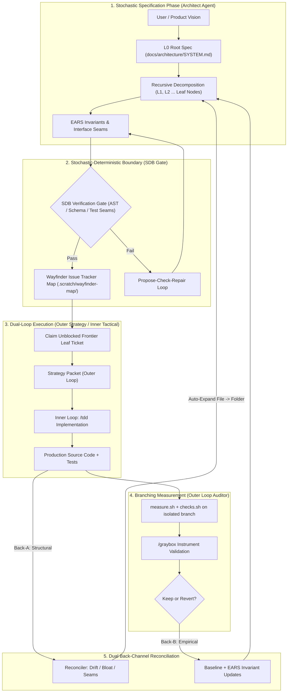

# Recursive System Specification (RSS) Engine & Agentic Framework

> **A PhD-grade, multi-signal, self-healing specification engine for AI-agent software engineering.**

---

## Executive Architecture Summary

The **Recursive System Specification (RSS)** engine solves the core failure mode of modern AI software development: **ephemeral context drift and "vibe coding."**

Instead of jumping directly from natural language prompts to code output, RSS creates a **living, fractal tree of machine-unambiguous specifications (`SYSTEM.md` nodes)** using **EARS Notation**, governed by a **Stochastic-Deterministic Boundary (SDB)**, synchronized with **Wayfinder execution frontiers**, and maintained through **dual back-channels** (structural + empirical) with **branching measurement** instead of test-green-only verification.

> **Evolved design:** See [DUAL_BACKCHANNEL_MEASUREMENT_LOOP.md](./DUAL_BACKCHANNEL_MEASUREMENT_LOOP.md) for the full 7-stage loop integrating dual-loop agents, graybox measurement, and autoresearch-style branching.



---

## Core System Pillars

### 1. Fractal Spec Topology (`docs/architecture/`)
Systems are structured recursively into directories where every node contains a `SYSTEM.md` contract.
- **Root (L0):** System-wide intent, global invariants, and component index.
- **Sub-systems (L1..LN):** Isolated sub-domain contracts.
- **Atomic Leaf Nodes:** Bottom-level specs implementable in a single TDD session.

### 2. EARS Notation for Machine-Unambiguous Contracts
All invariants in `SYSTEM.md` nodes must be written using **Easy Approach to Requirements Syntax (EARS)**:
- **[Ubiquitous]:** `The [Component] SHALL [behavior]`
- **[Event-driven]:** `WHEN [trigger] THE SYSTEM SHALL [behavior]`
- **[State-driven]:** `WHILE [state] THE SYSTEM SHALL [behavior]`
- **[Conditional]:** `IF [condition] THEN THE SYSTEM SHALL [behavior]`

### 3. Multi-Signal Self-Healing Reconciler
The spec tree dynamically refactors itself as development happens via 3 sensory signals:
- **Code Drift Signal:** Detects un-specced files in `/src` and generates draft leaf nodes.
- **Line Bloat Signal:** Converts single `.md` spec files crossing 150 lines into `folder/SYSTEM.md` directories with child specs.
- **Test Seam Signal:** Automatically syncs new test mocks/adapters back to interface contracts.

### 4. Tri-Agent Specialization & Anti-Authority Drift
To prevent agents from silently altering contracts or swallowing failing assertions:
- **Architect Subagent:** Responsible ONLY for spec decomposition and EARS invariants.
- **Implementor Subagent:** Operates under `/tdd` to write code against leaf contracts.
- **Auditor Subagent:** Runs `code-review-graph` AST checks to verify zero drift.

---

## Directory Structure

```
/recursive-system-design/
├── README.md                            # Master System Architecture Blueprint
├── ACADEMIC_RESEARCH_BLUEPRINT.md       # PhD/Formal Methods research foundation
├── MULTI_SIGNAL_SPEC_ENGINE.md          # Multi-signal auto-expansion spec
├── MISSING_ARCHITECTURAL_PILLARS.md     # EARS, ADRs, & AST gatekeeper design
├── DUAL_BACKCHANNEL_MEASUREMENT_LOOP.md # 7-stage loop: dual back-channels + branching measurement
├── docs/
│   ├── doc-readiness.md                 # GO / No-GO readiness checklist
│   └── architecture/                    # The Living Spec Tree
│       ├── SYSTEM.md                    # L0 Root Spec
│       ├── SPEC_ENGINE/SYSTEM.md        # L1 Leaf Node: EARS Spec Generator
│       ├── RECONCILER/SYSTEM.md         # L1 Leaf Node: Multi-Signal Auto-Expander
│       ├── WAYFINDER_CONNECTOR/SYSTEM.md# L1 Leaf Node: Ticket Publisher
│       └── AST_GATEKEEPER/SYSTEM.md     # L1 Leaf Node: AST Zero-Drift Checker
├── .scratch/
│   └── wayfinder-map/                   # Active Wayfinder Execution Frontier
│       ├── MAP.md                       # Master Frontier Index
│       ├── 01-spec-engine.md            # Leaf Implementation Ticket 01
│       └── 02-reconciler.md             # Leaf Implementation Ticket 02
└── skills/                              # Installed Agent Skills
    ├── recursive-spec/                  # User-invoked decomposition skill
    └── reconcile-spec/                  # Multi-signal self-healing skill
```

---

## First consumer project

**[featherwAIght-rs](../featherwAIght-rs)** is the greenfield Rust rebuild that uses this pipeline end-to-end: RSS skills (dual-loop, recursive-spec, reconcile-spec), `resources/skills` (wayfinder, tdd, research, …), graphgraph / sherloc / graybox, and CVL \(Q(S)\). Start there for architecture docs + Wayfinder map; keep this repo as the process source of truth.

## Available Agent Skills

You can invoke these skills anywhere in your workspace:

- **`/recursive-spec`** — Run an interactive interview to break any system into a fractal `SYSTEM.md` tree with EARS invariants, Epistemic Stages, §7 Measurement Seams, and Wayfinder tickets.
- **`/reconcile-spec`** — Dual back-channel reconcile: code drift, bloat, test seams, **and metric drift** (graphgraph-first).
- **`/dual-loop`** — Outer Architect/Auditor vs Inner Implementor; Strategy/Correction packets.
- **`/wayfinder`**, **`/sherloc`** — Installed under `skills/` (see `skills-lock.json`).
- Also compose with **`resources/skills`**: `/tdd`, `/research`, `/prototype`, `/domain-modeling`, `/implement`, `/code-review`, `/grilling`, `/handoff`, plus **graphgraph** / **graybox**.
