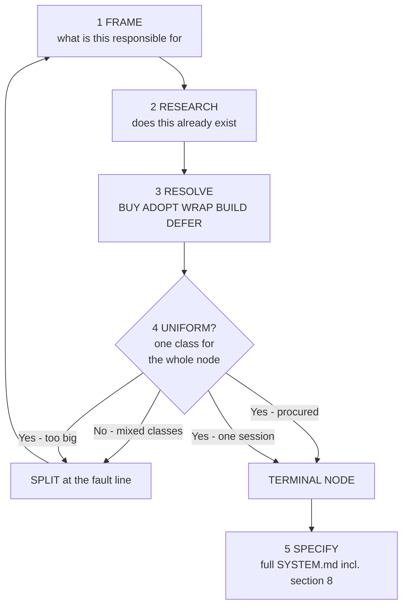

# Recursive Decomposition Loop

How a one-line goal becomes a tree of fully-specified, buildable leaves.

Module contract: [architecture/stack-resolver/SYSTEM.md](../architecture/stack-resolver/SYSTEM.md) ·
Resolution criteria: [stack-resolution.md](./stack-resolution.md) ·
Worked example: [examples/identity-design.md](../examples/identity-design.md)

---

## Problem

Ask any planner for a web app and you get a flat list:

```
- Landing page
- Login and user accounts
- Dashboard
- Settings
- CSS / design system
```

Every line is the same size on the page and wildly different in reality. "CSS" is an
afternoon with Tailwind. "Login and user accounts" is identity verification, session
lifecycle, authorization policy, account recovery, deletion under GDPR, and an audit
trail — five different problems with five different right answers, three of which you
should not write yourself.

The flat list fails in three specific ways:

| Failure | What it looks like |
|---------|-------------------|
| **Uniform granularity** | A line item that is one library sits beside a line item that is a quarter of work |
| **Reinvention by omission** | Nobody asked "does this exist already?", so a `users` table with hand-rolled password hashing gets written — the single most solved, highest-liability module in the list |
| **Unbuildable leaves** | "Login" names a topic, not a contract. An implementing agent must invent the tech stack, and each one invents a different stack |

The loop below fixes all three by forcing every node through the same five phases, and
by tying *when to stop* to *what you decided to use*.

---

## The loop

Run this for **every** node, starting at L0. It is the same five phases at every depth.



### 1. FRAME

Write the node's **single** responsibility as one sentence, plus what it explicitly does
*not* own. If the sentence needs an "and", that is the first evidence the node splits.

Frame in terms of the **capability**, not the implementation: "prove a visitor is who
they claim to be", not "users table". Naming the implementation this early is what
pre-commits you to building it.

### 2. RESEARCH

Before any decomposition, answer: **has this already been solved, and by whom?**

Survey managed services, OSS libraries, and framework-native features. Capture at least
two real alternatives with versions/pricing, and record what each does *not* cover — the
fit gap is usually where the node's real children live.

This is a genuine research obligation, not a gut call. Use `/research` for anything
unfamiliar; the output is a citable comparison, not a recollection. A node whose survey
cannot be completed is `DEFER` (below), not a guess.

> **Recency rule.** Library and pricing facts age badly. Verify against current docs
> rather than recalling — a stack chosen from stale memory is how a project adopts a
> deprecated SDK on day one.

### 3. RESOLVE

Assign the node exactly one **decision class**:

| Class | Meaning | Who owns the internals |
|-------|---------|------------------------|
| **BUY** | Managed third-party service; you hold an account | Vendor |
| **ADOPT** | OSS library or framework feature you run yourself | Upstream project |
| **WRAP** | Thin adapter you write over a BUY/ADOPT to fit your domain | You (the seam only) |
| **BUILD** | Genuinely custom code | You (entirely) |
| **DEFER** | Cannot resolve yet; needs research or a prototype | Nobody yet — blocks the subtree |

Criteria, scoring, and the anti-lock-in rules are in
[stack-resolution.md](./stack-resolution.md). The short version: **BUILD is the
class you must justify**, not the default. A node is only BUILD when it encodes something
specific to your product that no vendor can know.

### 4. TEST: is the resolution uniform?

This is the stopping rule, and it is the load-bearing part of the loop.

**Split the node when its decision class is not uniform across its parts.** If "login"
would be partly bought and partly built, the boundary between bought and built *is* the
seam — split exactly there. This is not arbitrary: a procurement boundary is already a
real interface, because you cannot refactor across a vendor's API.

A node is **TERMINAL** when one of these holds:

| Terminal because | Condition | What you spec |
|------------------|-----------|---------------|
| **Procured** | Resolved BUY or ADOPT, uniformly | The *seam* — config, contract, failure modes. **Not** the vendor's internals |
| **Atomic build** | Resolved BUILD or WRAP, and one engineer/agent can implement it in one TDD session against one test seam | Full leaf: §6 test seam, §7 measurement seam, §8 stack |
| **Deferred** | Resolved DEFER | A Type B Wayfinder ticket. Decomposition of this subtree resumes when the ticket closes |

A node **MUST decompose** when either:

- its parts would resolve to **different** classes (split at the fault line), **or**
- it is uniformly BUILD but too large for one session (split by interface seam, the
  classic rule from [contract-reconciliation](./contract-reconciliation.md)).

**Procured nodes do not decompose further.** Once "identity verification" resolves to
Google Identity Platform, you do not spec OIDC, then JWT signing, then RSA. The vendor
owns that. Stopping here is what keeps the tree finite and honest — the depth of a
subtree measures *how much you are building*, which is exactly the number you want
visible.

### 5. SPECIFY

Terminal nodes get a complete `SYSTEM.md` including **§8 Technology Resolution** — the
section that replaces the two-line summary with a real, actionable stack. Non-terminal
nodes get §1–§5 and a child index.

---

## Depth guards

Recursion needs brakes. Unbounded "break it down further" produces a tree nobody reads.

1. **Default max depth 4** (L0 → L3). Deeper needs an ADR on the node saying why.
2. **Procurement terminates.** Never decompose past a BUY/ADOPT boundary.
3. **Distinct failure mode test.** If a proposed child cannot fail independently of its
   siblings, it is not a module — it is a step in a procedure. Do not give it a node.
4. **Two-child minimum.** A node with exactly one child is a rename, not a decomposition.
   Collapse it.
5. **No speculative children.** Decompose what the current destination requires. Fog goes
   to the Wayfinder map's *Not yet specified* section, not into invented nodes.

The natural shape that results: **shallow where the world has already solved it, deep
where you are actually building something.** A tree that is uniformly deep means the
research phase is being skipped.

---

## What the loop produces

| Artifact | Where |
|----------|-------|
| Fractal contract tree | `docs/architecture/**/SYSTEM.md` |
| Per-leaf technology decision | §8 of each terminal node |
| Rejected alternatives + why | §8 of each terminal node (kept — this is the record that stops re-litigation) |
| Unresolved boundaries | Type B tickets on `.scratch/wayfinder-map/MAP.md` |
| Process incompleteness | [ROADMAP.md](../../ROADMAP.md) |

---

## Worked trace (abbreviated)

`Login` from the flat list above, run through the loop:

```
Identity & Access                          [mixed] -> SPLIT
├── Identity Verification                  BUY   -> TERMINAL (Google Identity Platform)
├── Session Management                     WRAP  -> TERMINAL (adapter over IdP tokens)
├── Authorization Policy                   [mixed] -> SPLIT
│   ├── Policy Evaluation                  ADOPT -> TERMINAL (Casbin / OPA)
│   └── Role & Permission Model            BUILD -> TERMINAL (domain-specific)
├── Account Lifecycle                      [mixed] -> SPLIT
│   ├── Recovery & Verification            BUY   -> TERMINAL (delegated to IdP)
│   └── Deletion & Export (GDPR)           BUILD -> TERMINAL (spans your data)
└── Auth Audit Trail                       ADOPT -> TERMINAL (OpenTelemetry)
```

One flat line became seven terminal nodes. **Five are procured or adopted; two are
genuinely custom** — and the two custom ones are precisely the parts that encode your
product, not the parts that encode "what is a password".

Full version with §8 stacks, alternatives, exit costs, and EARS invariants:
[examples/identity-design.md](../examples/identity-design.md).

---

## Relationship to the rest of Recurspec

| This loop | Feeds |
|-----------|-------|
| Terminal leaves + §6/§7 seams | `/recurspec` strategy packets |
| DEFER nodes | Wayfinder Type B research tickets |
| §8 decisions | Structural Feedback: a dependency that drifts from its spec is code drift |
| Alternatives + exit cost | ADR history when a vendor is later swapped |

The loop runs **forward** (vision → leaves). The feedback paths run **backward**
(reality → Contract Tree). A §8 entry whose pinned version no longer matches the lockfile is
exactly the kind of drift [`/recurspec`](../../src/recurspec/skill/SKILL.md) exists
to catch.
