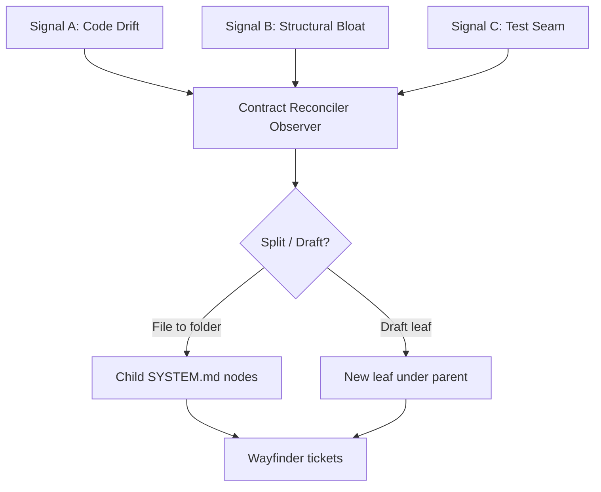

# Multi-Signal Structural Contract Reconciler

Structural Feedback detail. Module contract: [architecture/contract-reconciler/SYSTEM.md](../architecture/contract-reconciler/SYSTEM.md). Incomplete work is tracked in [ROADMAP.md](../../ROADMAP.md).

---

## Paradigm

Documentation is not a static write-once artifact. Under multi-agent edit rates, the
Contract Tree needs **sensory triggers** that open draft nodes, split bloated contracts,
and sync test-introduced seams.



Signal D (metric drift) is empirical — owned by Evaluation Gate + Empirical Feedback.

---

## Signal A — AST / code drift

- **Trigger:** New source file or exported symbol without a linked architecture node.
- **Action:** Propose a schema-valid `Unknown` draft under `docs/architecture/drafts/`;
  Architect review chooses the real parent and whether to apply it.
- **Research basis:** Requirements–design–code traceability (RE practice); SDB reject when drift is left unacknowledged at commit (research foundation §2–§3).

---

## Signal B — structural bloat

- **Trigger:** Contract Node exceeds 150 lines, or its §1 explicitly declares more than
  three semicolon-separated `- **Responsibilities:**` entries with separable interfaces.
- **Action:** Emit a split-review proposal. Architect review identifies separable
  responsibilities before any file-to-folder edit or child ticket is created.
- **Research basis:** Recursive modular decomposition / deep modules (interface vs implementation complexity); ADR hygiene for *why* the split occurred.

---

## Signal C — test seam expansion

- **Trigger:** TDD introduces a mock/adapter not listed in parent interface contracts.
- **Action:** Emit a test-seam-review proposal; do not silently expand production coupling.

---

## Example evolution

```
Day 1:  docs/architecture/profile-page/SYSTEM.md   (single leaf)

Day N:  docs/architecture/profile-page/
          SYSTEM.md
          header/SYSTEM.md
          bio-form/SYSTEM.md
          privacy-settings/SYSTEM.md
```

Wayfinder may carry execution detail for child frontier tickets, but every deferred task
or incomplete feature retains its canonical row in `ROADMAP.md`; the tracker never
becomes a parallel readiness list.

---

## Rules

1. Prefer **interface-driven** splits over arbitrary line cuts.
2. Never invent requirements during auto-draft; mark Epistemic Stage `Unknown` until Architect review.
3. Do not treat reconcile as a substitute for measurement (Empirical Feedback).
