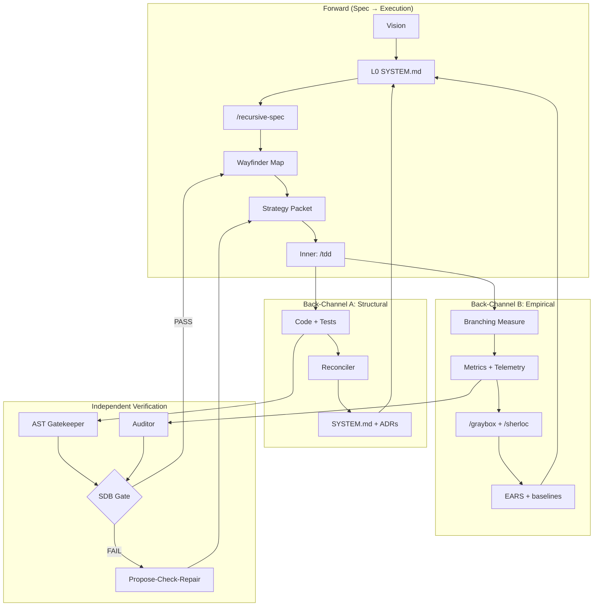
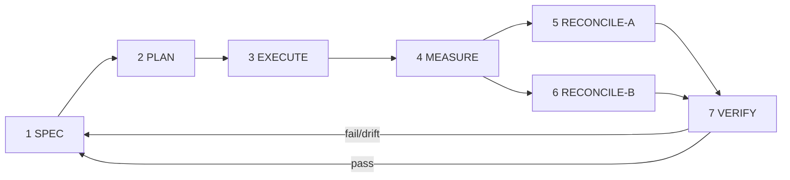

# Dual Back-Channel + Branching Measurement Loop

Operational process for RSS. Incomplete phases are tracked only in [open-work.md](../open-work.md). Research citations live in [research/foundation.md](../research/foundation.md).

---

## Problem

Test-green-only agent loops fail in three ways:

| Failure | Symptom | Cause |
|---------|---------|--------|
| Verification debt | “Done” but wrong on untested inputs | No measurement beyond the test seam |
| Authority drift | Contracts weakened so tests pass | Implementor grades own work |
| Comprehension rot | Blueprint diverges from behavior | Spec updated only on structural drift |

Fix: dual back-channels (structure + behavior), dual-loop agent separation, branching measurement, and an SDB gate (see research foundation).

---

## Architecture



---

## Back-Channel A — Structural

**Direction:** artifacts → blueprint. **Skills:** `/reconcile-spec`, AST Gatekeeper.

| Signal | Trigger | Action |
|--------|---------|--------|
| Code Drift | `/src` file without parent spec | Draft leaf `SYSTEM.md` |
| Line Bloat | Spec > ~150 lines or > 3 responsibilities | File → folder recursive split |
| Test Seam | New mock/adapter in TDD | Update parent interfaces |

*Does the blueprint describe what exists?*

Detail: [multi-signal-reconciler.md](./multi-signal-reconciler.md).

---

## Back-Channel B — Empirical

**Direction:** measured behavior → blueprint. **Skills:** measure harness, `/graybox`, `/sherloc`.

| Signal | Trigger | Action |
|--------|---------|--------|
| Invariant Violation | Measure contradicts EARS | Refine/split invariant; ADR |
| Performance Regression | Metric > baseline + tolerance | Performance EARS clause or ticket |
| Telemetry Contradiction | Self-metrics disagree (graybox red) | Flag instrument; block merge |
| Unknown Boundary | Behavior unclear | Type B research/prototype ticket |

*Does the blueprint describe how it behaves?*

**Rule:** Implementor self-assessment is non-authoritative. Auditor runs measurement on an isolated branch.

---

## Branching measurement

Per atomic leaf, `SYSTEM.md` §7:

- Primary metric + target + `measure.sh`
- Correctness backpressure: `checks.sh` must pass before keep
- Telemetry surface: structured diagnostics for Auditor without trusting source narrative
- Worktree hypothesis; keep iff checks pass ∧ metric improves ∧ no telemetry contradiction

```
OUTER (Architect/Auditor)
  baseline → strategy packet → hand Inner worktree
  on done: checks → measure → graybox → keep|revert
  update blueprint via A/B → Wayfinder

INNER (Implementor)
  strategy packet only · /tdd · no authoritative merge · no parent contract edits
```

---

## Seven-stage master loop

| Stage | Role | Skills | Verification |
|-------|------|--------|--------------|
| 1 SPEC | Architect | `/recursive-spec`, `/wayfinder`, domain modeling | EARS + open-work gate |
| 2 PLAN | Architect (Outer) | dual-loop packets | Packet completeness |
| 3 EXECUTE | Implementor (Inner) | `/tdd`, `/implement` | Self-check only |
| 4 MEASURE | Auditor (Outer) | measure, graybox, sherloc | L1 metrics + L3 fixtures |
| 5 RECONCILE-A | Reconciler | `/reconcile-spec`, AST | L2 schema/drift |
| 6 RECONCILE-B | Auditor | baselines, metamorphic | L1 + instrument honesty |
| 7 VERIFY | Independent Auditor | graph tools, review | Maker ≠ checker; SDB |



---

## Orthogonal axes

| Axis | Meaning |
|------|---------|
| Dual-Loop | Who executes vs who verifies |
| Dual Back-Channel | What feeds the blueprint (structure vs behavior) |
| Branching Measurement | How empirical truth is isolated |

---

## Session flow (example: OW-01 / ticket 01)

1. Claim ticket on Wayfinder map  
2. Load `docs/architecture/spec-engine/SYSTEM.md`  
3. Outer: strategy packet + measure scaffold  
4. Baseline `measure.sh`  
5. Inner: implement via `/tdd`  
6. Outer: checks → measure → graybox  
7. Reconcile-A / Reconcile-B  
8. SDB verify; close ticket; update open-work  

Incomplete infrastructure for this flow: [open-work.md](../open-work.md) (OW-05, OW-10–OW-13).
