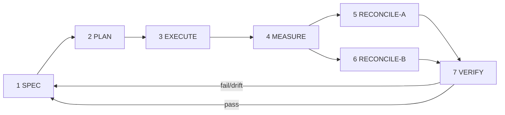

# Evidence Cycle

Operational process for Recurspec. Incomplete phases are tracked only in [ROADMAP.md](../../ROADMAP.md). Research citations live in [research/foundations.md](../research/foundations.md).

---

## Problem

Test-green-only agent loops fail in three ways:

| Failure | Symptom | Cause |
|---------|---------|--------|
| Verification debt | “Done” but wrong on untested inputs | No measurement beyond the test seam |
| Authority drift | Contracts weakened so tests pass | Implementor grades own work |
| Comprehension rot | Contract Tree diverges from behavior | Contract updated only on structural drift |

Fix: Structural and Empirical Feedback, maker-checker separation, branching measurement, and an SDB gate (see research foundations).

---

## Architecture

```mermaid
graph TB
    subgraph Forward["Forward (Spec → Execution)"]
        Vision["Vision"] --> L0["L0 SYSTEM.md"]
        L0 --> Recursive["/recurspec"]
        Recursive --> WF["Wayfinder Map"]
        WF --> Packet["Strategy Packet"]
        Packet --> Inner["Inner: /tdd"]
    end

    subgraph BackA["Structural Feedback: Structural"]
        Inner --> Code["Code + Tests"]
        Code --> Contract Reconciler["Contract Reconciler"]
        Contract Reconciler --> SpecUpdate["SYSTEM.md + ADRs"]
        SpecUpdate --> L0
    end

    subgraph BackB["Empirical Feedback: Empirical"]
        Inner --> Measure["Branching Measure"]
        Measure --> Metrics["Metrics + Telemetry"]
        Metrics --> Graybox["/graybox + /sherloc"]
        Graybox --> Inv["EARS + baselines"]
        Inv --> L0
    end

    subgraph Verify["Independent Verification"]
        Code --> AST["Structure Gate"]
        Metrics --> Auditor["Auditor"]
        AST --> Gate{"SDB Gate"}
        Auditor --> Gate
        Gate -- PASS --> WF
        Gate -- FAIL --> Repair["Propose-Check-Repair"]
        Repair --> Packet
    end
```

---

## Structural Feedback — Structural

**Direction:** artifacts → Contract Tree. **Skills:** `/recurspec`, Structure Gate.

| Signal | Trigger | Action |
|--------|---------|--------|
| Code Drift | `/src` file without parent spec | Draft leaf `SYSTEM.md` |
| Line Bloat | Spec > ~150 lines or > 3 responsibilities | File → folder recursive split |
| Test Seam | New mock/adapter in TDD | Update parent interfaces |

*Does the Contract Tree describe what exists?*

Detail: [contract-reconciliation.md](./contract-reconciliation.md).

---

## Empirical Feedback — Empirical

**Direction:** measured behavior → Contract Tree. **Skills:** measure Evaluation Gate,
`/graybox`, `/sherloc`.

| Signal | Trigger | Action |
|--------|---------|--------|
| Invariant Violation | Measure contradicts EARS | Refine/split invariant; ADR |
| Performance Regression | Metric > baseline + tolerance | Performance EARS clause or ticket |
| Telemetry Contradiction | Self-metrics disagree (graybox red) | Flag instrument; block merge |
| Unknown Boundary | Behavior unclear | Type B research/prototype ticket |

*Does the Contract Tree describe how it behaves?*

**Rule:** Implementor self-assessment is non-authoritative. Auditor runs measurement on an isolated branch.

---

## Branching measurement

Per atomic leaf, `SYSTEM.md` §7:

- Primary metric + target + `measure.sh` — one metric (legacy) or a tiered `"metrics"` list (`hard_gate` / `target` / `optimization` / `observation`; untagged defaults to `hard_gate`)
- Correctness backpressure: `checks.sh` must pass before keep
- Telemetry surface: structured diagnostics for Auditor without trusting source narrative
- Worktree candidate; keep iff checks pass ∧ no `hard_gate`/`target`/`optimization` metric regresses beyond tolerance ∧ no telemetry contradiction (`src/recurspec/metrics.py:evaluate_candidate`)
- Every revert writes a **Negative Pattern** to `.recurspec/evidence/<module>/log.jsonl`; a repair pass must read it before proposing another change
- **Escalation boundary:** 5 consecutive reverts on one Candidate branch (stagnation) or 8 total (attempt ceiling) stops automatic repair and hands the ticket to a human (`evaluation.py` exit code 3) — see [Recurspec](../../src/recurspec/skill/SKILL.md)

The **trunk baseline** (`find_baseline`, promoted only via `--record-baseline` after merge) is Recurspec's Best Known State: the metric vector every future candidate is judged against. A kept candidate does not automatically become BKS — promotion is the Outer Loop's explicit act, not the keep/revert gate's.

```
OUTER (Architect/Auditor)
  baseline → strategy packet → hand Inner worktree
  on done: checks → measure → graybox → keep|revert
  update Contract Tree via A/B → Wayfinder

INNER (Implementor)
  strategy packet only · /tdd · no authoritative merge · no parent contract edits
```

---

## Seven-stage master loop

| Stage | Role | Skills | Verification |
|-------|------|--------|--------------|
| 1 SPEC | Architect | `/recurspec`, `/wayfinder`, domain modeling | EARS + ROADMAP gate |
| 2 PLAN | Architect | bounded strategy handoffs | Handoff completeness |
| 3 EXECUTE | Implementor (Inner) | `/tdd`, `/implement` | Self-check only |
| 4 MEASURE | Auditor (Outer) | measure, graybox, sherloc | L1 metrics + L3 fixtures |
| 5 RECONCILE-A | Contract Reconciler | `/recurspec`, AST | L2 schema/drift |
| 6 RECONCILE-B | Auditor | baselines, metamorphic | L1 + instrument honesty |
| 7 VERIFY | Independent Auditor | graph tools, review | Maker ≠ checker; SDB |



---

## Orthogonal axes

| Axis | Meaning |
|------|---------|
| Dual-Loop | Who executes vs who verifies |
| Dual Feedback | What updates the Contract Tree (structure vs behavior) |
| Branching Measurement | How empirical truth is isolated |

---

## Session flow (example: R-200 / ticket 200)

1. Claim ticket on Wayfinder map
2. Load `docs/architecture/contract-engine/SYSTEM.md`
3. Outer: strategy packet + measure scaffold
4. Baseline `measure.sh`
5. Inner: implement via `/tdd`
6. Outer: checks → measure → graybox
7. Reconcile-A / Reconcile-B
8. SDB verify; close ticket; update `ROADMAP.md`

Incomplete infrastructure for this flow: [ROADMAP.md](../../ROADMAP.md).
